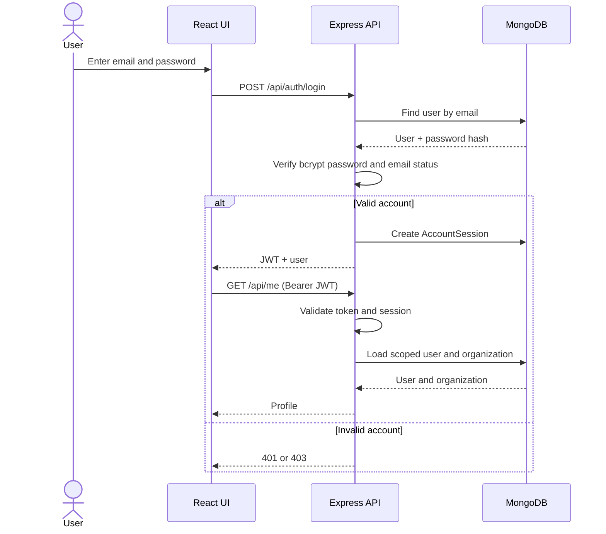

# Login and session flow

```mermaid
sequenceDiagram
    actor User
    participant Web as React UI
    participant API as Express API
    participant DB as MongoDB
    User->>Web: Enter email and password
    Web->>API: POST /api/auth/login
    API->>DB: Find user by email
    DB-->>API: User + password hash
    API->>API: Verify bcrypt password and email status
    alt Valid account
        API->>DB: Create AccountSession
        API-->>Web: JWT + user
        Web->>API: GET /api/me (Bearer JWT)
        API->>API: Validate token and session
        API->>DB: Load scoped user and organization
        DB-->>API: User and organization
        API-->>Web: Profile
    else Invalid account
        API-->>Web: 401 or 403
    end
```

Current client token/session pattern must be reviewed for production hardening.
