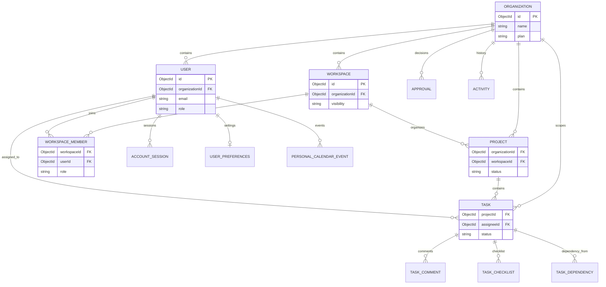

# Data model (simplified)

```mermaid
erDiagram
    ORGANIZATION ||--o{ USER : contains
    ORGANIZATION ||--o{ WORKSPACE : contains
    ORGANIZATION ||--o{ PROJECT : contains
    ORGANIZATION ||--o{ TASK : scopes
    WORKSPACE ||--o{ WORKSPACE_MEMBER : memberships
    USER ||--o{ WORKSPACE_MEMBER : joins
    WORKSPACE ||--o{ PROJECT : organizes
    PROJECT ||--o{ TASK : contains
    USER ||--o{ TASK : assigned_to
    TASK ||--o{ TASK_COMMENT : comments
    TASK ||--o{ TASK_CHECKLIST : checklist
    TASK ||--o{ TASK_DEPENDENCY : dependency_from
    USER ||--o{ ACCOUNT_SESSION : sessions
    USER ||--o| USER_PREFERENCES : settings
    USER ||--o{ PERSONAL_CALENDAR_EVENT : events
    ORGANIZATION ||--o{ APPROVAL : decisions
    ORGANIZATION ||--o{ ACTIVITY : history
    ORGANIZATION {
      ObjectId id PK
      string name
      string plan
    }
    USER {
      ObjectId id PK
      ObjectId organizationId FK
      string email
      string role
    }
    WORKSPACE {
      ObjectId id PK
      ObjectId organizationId FK
      string visibility
    }
    WORKSPACE_MEMBER {
      ObjectId workspaceId FK
      ObjectId userId FK
      string role
    }
    PROJECT {
      ObjectId organizationId FK
      ObjectId workspaceId FK
      string status
    }
    TASK {
      ObjectId projectId FK
      ObjectId assigneeId FK
      string status
    }
```

Mongoose associations are application-managed references; not relational FK constraints. Some fields are optional/legacy.
