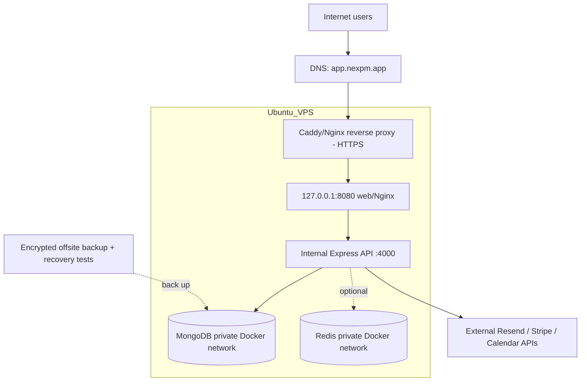

# Single-VPS deployment (proposed staging topology)

```mermaid
flowchart TB
    I[Internet users] --> DNS[DNS: app.nexpm.app]
    DNS --> TLS[Caddy/Nginx reverse proxy - HTTPS]
    TLS --> UI[127.0.0.1:8080 web/Nginx]
    UI --> API[Internal Express API :4000]
    API --> M[(MongoDB private Docker network)]
    API -. optional .-> RED[(Redis private Docker network)]
    API --> EXT[External Resend / Stripe / Calendar APIs]
    BACK[Encrypted offsite backup + recovery tests] -. back up .-> M
    subgraph Ubuntu_VPS
      TLS
      UI
      API
      M
      RED
    end
```

**Security:** Database ports must not be public. This diagram is an architecture proposal, not evidence of production deployment.
