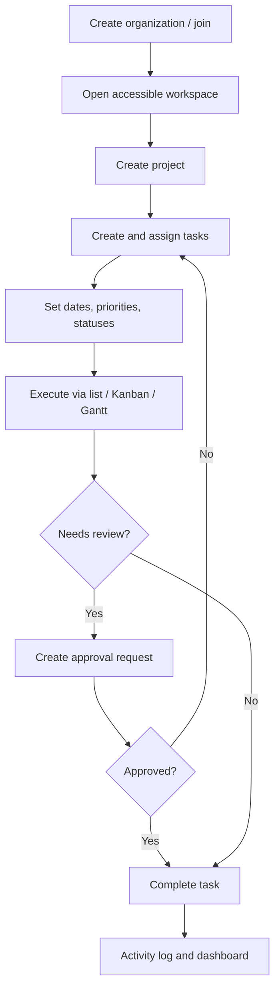

# Workflow from organization to completion

```mermaid
flowchart TD
    A[Create organization / join] --> B[Open accessible workspace]
    B --> C[Create project]
    C --> D[Create and assign tasks]
    D --> E[Set dates, priorities, statuses]
    E --> F[Execute via list / Kanban / Gantt]
    F --> G{Needs review?}
    G -->|Yes| H[Create approval request]
    H --> I{Approved?}
    I -->|No| D
    I -->|Yes| J[Complete task]
    G -->|No| J
    J --> K[Activity log and dashboard]
```

This is an illustrative user process; NexPM does **not** enforce this as a mandatory automated workflow engine.
