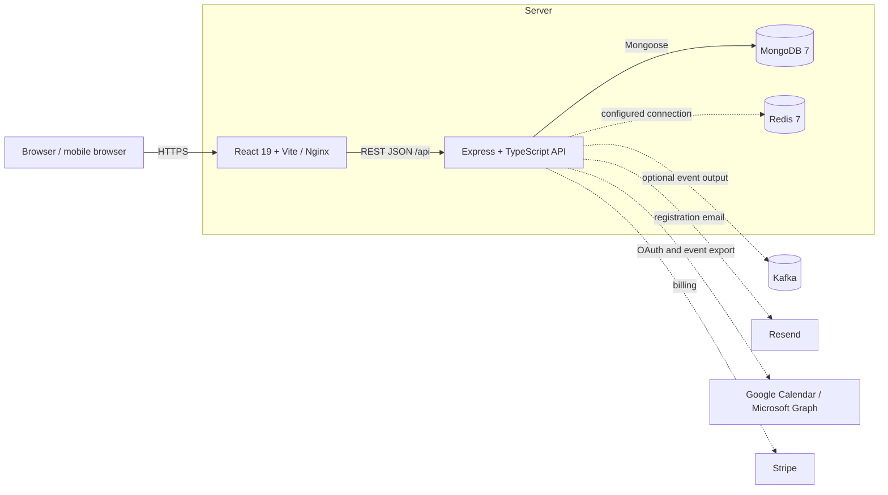

# System architecture

```mermaid
flowchart LR
    U[Browser / mobile browser] -->|HTTPS| W[React 19 + Vite / Nginx]
    W -->|REST JSON /api| A[Express + TypeScript API]
    A -->|Mongoose| DB[(MongoDB 7)]
    A -. configured connection .-> R[(Redis 7)]
    A -. optional event output .-> K[(Kafka)]
    A -. registration email .-> E[Resend]
    A -. OAuth and event export .-> C[Google Calendar / Microsoft Graph]
    A -. billing .-> S[Stripe]
    subgraph Server
      W
      A
      DB
      R
    end
```

**Note:** Redis is provisioned but not proof of active caching or a task worker. Kafka is optional.
